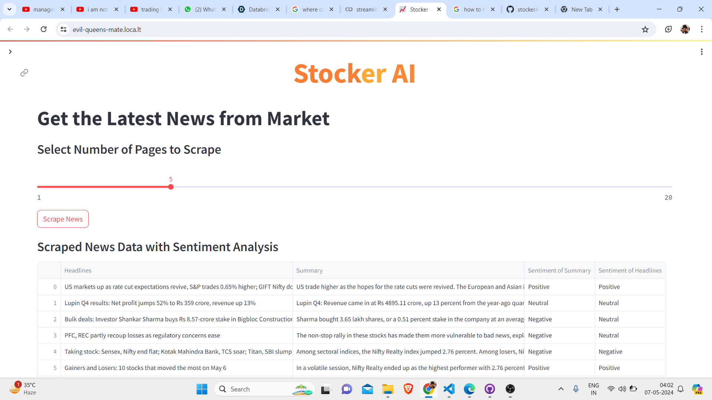
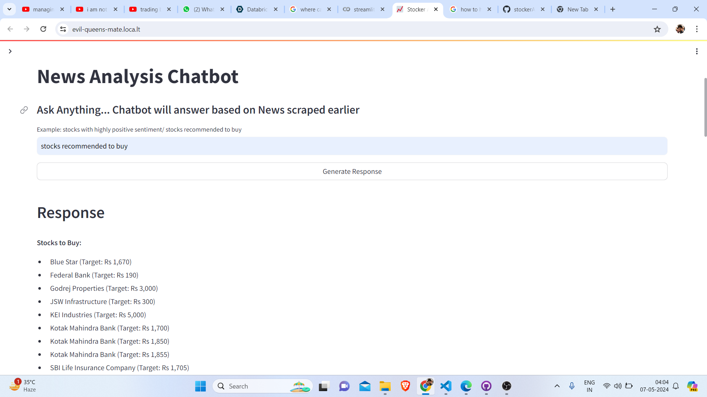
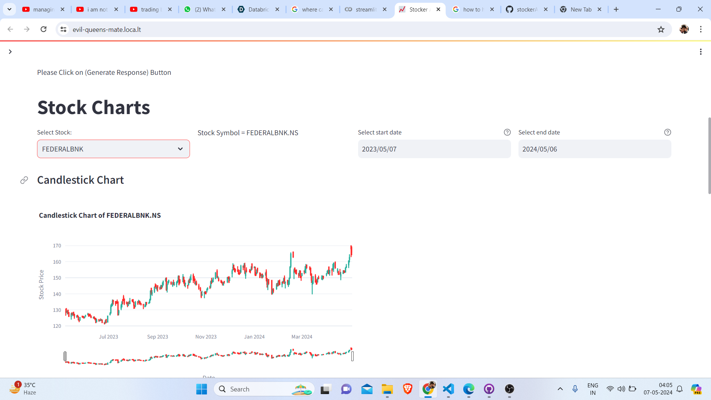
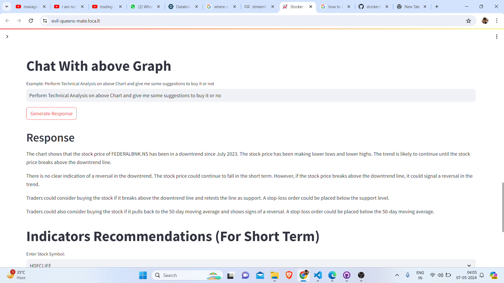
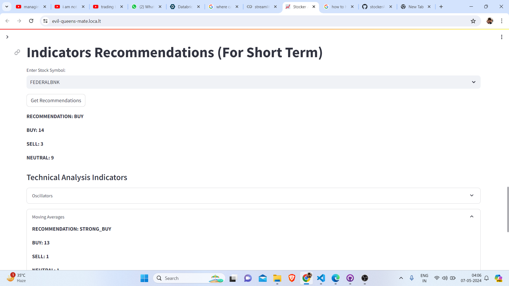
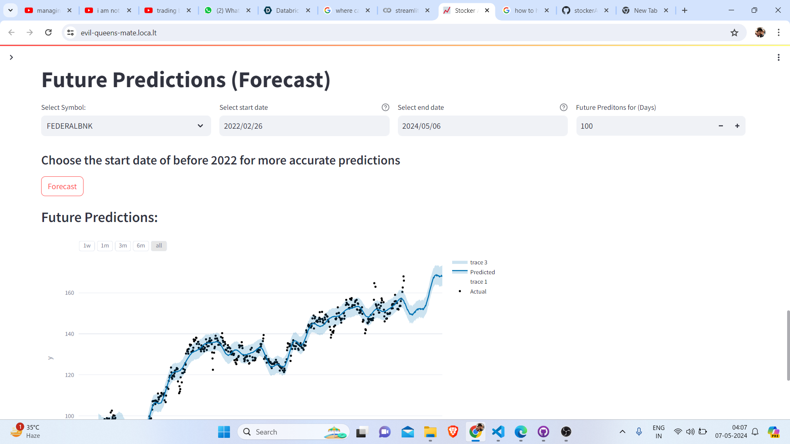

# Stocker AI

## Overview

**Stocker AI** is an automated stock market analysis tool designed to provide users with comprehensive insights and forecasts in the financial market. The application integrates several innovative features, utilizing advanced technologies to enhance user experience and decision-making in stock trading.

---

## Features

### 1. Get the Latest News from the Market
This feature scrapes the latest news from the **Moneycontrol** website and presents it in a Streamlit DataFrame format. The DataFrame includes:

- **Summary of the news**
- **Headlines**
- **Sentiment analysis** for both the summary and headlines
- **Pie charts** displaying the sentiment distribution for the summary and headlines

> **Note:** Users can read the complete articles on the Moneycontrol website, and links are provided in the Stocker app itself under the news section.

(Screenshot 2024-05-07 040243.png)

---

### 2. News Analysis Chatbot
Users can interact with a chatbot to retrieve insights from the scraped news without reading the articles. The chatbot can answer queries like:

- Stocks recommended to buy
- Which stocks received investments, etc.

This functionality is powered by **MongoDB Atlas** for vector search, **CosmoCloud** as the backend layer, and **Gemini AI** as the language model.



---

### 3. Stock Charts
Stocker AI provides various stock charts, including:

- Candlestick charts
- Line charts
- Daily returns
- Volume charts

These charts are available for **1,965 companies** listed on the **NSE** and are generated using **Plotly** and **yfinance**.

(Screenshot 2024-05-07 040519.png)

---

### 4. Chat with Graph
This unique feature uses the **Gemini-1.5-pro-latest model** to perform direct analyses on stock charts based on user queries. Users no longer need to manually analyze the charts, as this chatbot automates the process.



---

### 5. Indicators Recommendations
Stocker AI provides clear recommendations based on technical indicators in the market. This includes insights from oscillators, moving averages, and other indicators to guide users in their trading decisions.



---

### 6. Forecast
The application offers forecasts for the upcoming months based on user specifications. This feature employs the **Facebook Prophet** model to generate reliable predictions.



---

## Getting Started

To get started with Stocker AI, clone the repository and follow the instructions in the installation section.

```bash
git clone https://github.com/VaibhavKothe/stockerAI.git
cd stockerAI
